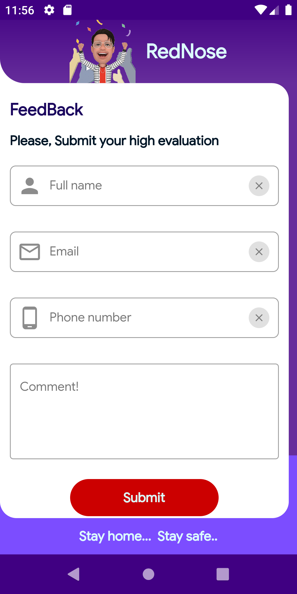

 

   

<H1>RedNose</H1>

## Introduction
### TRACK COVID-19 AT WORLD WIDE

RedNose is an open source app made with Flutter framework to provide the status of Covid-19 pandemic all over the world. It shows all the Status like Confirmed, Recovered, Dead, Critical, Tests, Active and more with form of graph (line and bar chart)

* Location based status
* Able to Search worldwide, Stat wise, County/District wise
* We can filter by case
* Get nearest help resources and show flash news about covid.
 
## Features/Modules
### Home
Displaying covid-19 cases world wide and device located country
## Screenshots

|Splash screen | Home page | Country search |
|--------------|------------|-------------|

| |  |  

|LeftMenu | Selected Country |
|--------------|------------|

|  | 

### Particular Country details(USA)

| States | Search state | Selected state's county|
|--------------|----------------|----------------|
|  |  | 

### Particular Country details(India)
Case details about India wise

| List of affected states | Bar chart for affected states |
|--------------|----------------| 
|  | 

| Search state | Selected state's Districts |
|--------------|----------------| 
|  | 

| District case details |
|--------------|
|  |

| Current news | Zones | Nation wide Help Resorces |
|--------------|----------------|----------------| 
|  | | 

| Symptoms | Prevention |
|--------------|----------------| 
|  | 

| Feedback | About RedNose | About me |
|--------------|----------------|---------| 
|  | |
